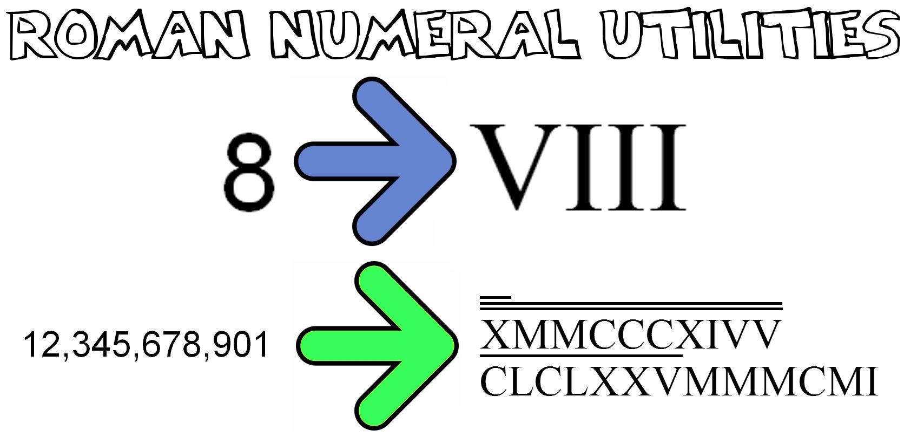

# Roman Numeral Converter and Utilities

*You* input a Roman Numeral or an integer.

*We* return that number converted.

Covers numbers in the trillions, with thousands of unit tests and tons of Roman Numeral functionality.

## TOC

1. [TOC](#toc)
2. [Online Demos](#online-demos)
3. [Features](#features)
4. [Functionality](#funtionality)
5. [Example Usage](#example-usage)
6. [Code Structure and Design](#code-structure-and-design)

## Online Demos

_Check out the code in an online demo..._

### Roman Numeral Converter

#### Simple Demo.

_Just click the link, fill in a number, push the button, and go..._

* [Roman Numeral Converter Script, hosted at EarthFluent.com](http://www.earthfluent.com/roman-numerals-converter-demo.html)

### Roman Numeral List Utility

#### Simple Demo.

_Just click the link, push the button, and go..._

* [Roman Numeral Lister Script, hosted at EarthFluent.com](http://www.earthfluent.com/roman-numerals-lister-demo.html)

## Features

_How much is here?_

* **Powerful** - Can Handle Any Whole, Positive Number - Capable of handling numbers up to 10^60.
    * 1 to 3,999 : Represented in the classical way taught to children.
    * 4,000 to 3,999,999 : Represented with a dash over the high-valued, Roman numerals.  Still traditional, but less so.
    * 4,000,000 to 3,999,999,999 : Represented with two dashes over the high-valued, Roman numerals.  Untraditional.
    * 4,000,000,000 to 3,999,999,999,999 : Represented with three dashes over the high-valued, Roman numerals.  Untraditional.
    * 4,000,000,000,000 to 3.999... * 10^60 : Represented using all unused Latin letters as multiplyer characters.  Brand new.
* **Fast** - Optimal algorithm design.
    * Roman-To-Integer Algorithm: Beats 100% of other algorithms on LeetCode.
    * Integer-To-Roman Algorithm: Beats 100% of other algorithms on LeetCode.
* **Reliable** - Unit Tests: 40,000 total.
    * Converting Roman Numerals to Integers : 10,000 unit tests.
    * Converting Integers to Roman Numerals : 10,000 unit tests.
    * Listing Roman Numerals : 10,000 unit tests.
    * Listing Integers : 10,000 unit tests.

## Functionality

_How exactly does it work?_

* **Exact / Error-Resistant**
    * The Roman Numerals are defined linguistically, allowing certain values to appear after others, similar to Markov Chain.
    * Since this rigid definition is in place, the odds of any particular number generation (up to 10^60) being incorrect is amazingly small.
* **Fast / Efficient**
    * Algorithm for Converting: Defined using optimal results.
    * Algorithm for Listing: Defined using optimal results.

## Example Usage

_How do I use the Roman Numeral Converter and Utilities?_

### Convert Roman Numeral to an Integer

_How do I convert a Roman Numeral to an integer?_

~~~~
var output = convertRomanToInteger({'number':'viii'});

console.log(output);    // result: 8
~~~~

### Convert Integer to a Roman Numeral

_How do I convert an integer to a Roman Numeral?_

~~~~
var output = convertIntegerToRoman({'number':42});

console.log(output);    // result: "xlii"
~~~~

### List Roman Numerals within a Range

_How do I list Roman Numerals within a certain range?_

~~~~
var romanlist = generateRomanNumerals({'min':1, 'max':9999});

console.log(romanlist[100]);    // result: "c"
~~~~

### List Roman Integers within a Range

_How do I list integers within a certain range?_

~~~~
var integerlist = generateIntegerNumbers({'min':1, 'max':9999});

console.log(romanlist[100]);    // result: "100"
~~~~

## Code Structure and Design

### Coding Languages

_What coding languages are used in the Roman Numeral Converter and Utilities?_

The entire project is coded in the following...

* *HTML* - For providing the bare page itself with a minimum of elements.
* *CSS* - Minimum of styling, as well as handling the odd situation in Roman Numerals where one may need multiple lines over a number to indicate its true, full value.
* *jQuery* - For handling the UI.
* *JavaScript* - For doing the number conversions and the utilities.

### roman-numerals.js - Technical Overview

_What are the functions in the sourcecode files for?_

*roman-numerals.js*

_For converting Roman Numerals and Roman Numeral Utilities._

**Globals**

* getTimeOutDelay()
    * Get the delay of the timeout for typing.
* processingText()
    * Get the text to display when the keyword list generator is thinking.
* waitingForUserText()
    * Get the text to display when the keyword list generator is waiting.

**Event and Element Handlers**

* $('.input-area').keyup(function(e) {...})
    * Run findKeywords() only after so much time has delayed from keyup movements.
* $('.input-area').click(function(e) {...})
    * Clear the input area of its default instruction set when input area is clicked.
* $('.find-keywords-button').click(function(e) {...})
    * User clicked the "Find Keywords" button.
    * Regenerate the keyword list.
* $('#casing').change(function(e) {...})
    * User changed the sort order of the keyword lists.
    * Regenerate the keyword list.
* initiateApp()
    * Clear the input area of its default instruction set.
    * Bound to many event handlers.

**Input Cleanup**

* getInput()
    * Get the input source for generating the keyword list.
* cleanupInput(args)
    * Cleanup the input from the user.
* formatInput(args)
    * Format the input from the user.
    * Specifically, lowercase and, if necessary, strip HTML.
* getCleanupReplacements()
    * Get text replacements for cleanup.
* replaceBulk(args)
    * Replace the cleanup replacements with their correct values.

**Number-Conversion Logic**

* convertNumbers()
    * Main function for converting numbers.
* formatFinalOutput(args)
    * Given output to display to user, format it.
* formatOutputWithLines(args)
    * Given a Roman Numeral value, format it so that it displays the lines/dashes overhead of the number, if applicable.
* formatOutputWithLines_specialPiece(args)
    * Put the necessary amount of lines or dashes overhead of a Roman Numeral, based on its size.
* convertRomanToInteger(args)
    * Given a Roman Numeral, convert it to a base-10integer.
* convertIntegerToRoman(args)
    * Given an Integer (int format), convert it to a Roman Numeral string.
* convertIntegerToRoman_calculate4PointBlocks(args)
    * Calculate each set of 4 point blocks, in terms of converting from an integer to a Roman numeral.
* convertIntegerToRoman_calculate3PointBlocks(args)
    * Calculate each set of 3 point blocks, in terms of converting from an integer to a Roman numeral.
* calculate4PointRomanBlock(args)
    * Given a large Roman Numeral, i.e., a large one, above 1,000, calculate the integer value.
    * A 4-point-block is lexicographically more complex than the 3-point-block.  The 4-point-block uses more memorization and less logic.
* calculate3PointRomanBlock(args)
    * Given ordinary Roman Numeral, i.e., a small one, below 1,000, calculate the integer value.
    * A 3-point-block is lexicographically-simpler than the 4 point-block.  The 3-point-block uses more logic and less memorization.
* convertIntegerToRoman_getIncrementersHash()
    * Build a hash that represents the values of the Roman numeral prefix multiplyers.

**List Builder**

* getIgnoreKeywords_romanNumerals_numbersOnly()
    * Get a list of Roman numerals to ignore.
    * For example: i, ii, iii, etc..
* generateIntegerNumbers(args)
    * Given a min and a max, return a list of integer numbers bound by that constraint.
* generateRomanNumerals(args)
    * Given a min and a max, return a list of Roman Numerals bound by that constraint.
* formatRomanNumerals(args)
    * Given an array of Roman numerals, format each element.
* getIgnoreKeywords_romanNumerals_mergeLists(args)
    * Given two lists of roman numerals, merge them together.
    * For example: (i)x, (ii)x, (iii)x, (iv)x,... (ix)x. etc..
* convertIntegerToRoman_getIncrementers()
    * Get the prefix incrementers, listed in reverse order.
    * These are the values before a roman number that cause to be multiplied in value and to appear with so-many dashes overhead.
    * Active, Enabled, and Tested: O, U, T, A. (trillions)
    * Disabled for Memory Constraints: B, E, F, G, H, J, K, L, N, P, Q, R, S, W, Y, Z.
* getRomanNumerals_firstDigitValues()
    * Get the first digit (0-9) values for the Roman Numeral system.
    * For example: (nothing; i.e., zero), i, ii, iii, etc..
* getRomanNumerals_secondDigitValues()
    * Get the second digit (00-90) values for the Roman Numeral system.
    * For example: (nothing; i.e., zero), x (10), xx (20), xxx (30), etc..
* getRomanNumerals_thirdDigitValues()
    * Get the third digit (000-900) values for the Roman Numeral system.
    * For example: (nothing; i.e., zero), c (100), cc (200), ccc (300), etc..
* getRomanNumerals_fourthDigitValues()
    * Get the fourth digit (0000-9000) values for the Roman Numeral system.
    * For example: (nothing; i.e., zero), m (1000), mm (2000), mmm (3000), etc..
* getRomanNumerals_fifthDigitValues()
    * Get the fourth digit (00000-90000) values for the Roman Numeral system.
    * For example: (nothing; i.e., zero), ox (10000), oxox (20000), oxoxox (30000), etc..
* getRomanNumerals_sixthDigitValues()
    * Get the fourth digit (000000-900000) values for the Roman Numeral system.
    * For example: (nothing; i.e., zero), oc (100000), ococ (200000), ocococ (300000), etc..
* getRomanNumerals_seventhDigitValues()
    * Get the fourth digit (0000000-9000000) values for the Roman Numeral system.
    * For example: (nothing; i.e., zero), om (1000000), omom (2000000), omomom (3000000), etc..
* getRomanNumerals_eighthDigitValues()
    * Get the fourth digit (00000000-90000000) values for the Roman Numeral system.
    * For example: (nothing; i.e., zero), om (10000000), omom (20000000), omomom (30000000), etc..

*roman-numerals-unit-tests.js*

_For unit-testing the Roman Numerals and Roman Numeral Utilities._

* enableUnitTests()
    * Enable unit-testing.
* logUnitTests()
    * Enable unit-testing logging.
* runUnitTests
    * Run the unit tests.
* runUnitTests_romanList()
    * Run the unit tests for the Roman-Numeral generating function.
* runUnitTests_integerList()
    * Run the unit tests for the integer-unmber generating function.
* indicateUnitTestStart()
    * Indicate the number of unit tests to conduct.
* indicateUnitTestEnd()
    * Indicate the number of unit tests conducted.
* getUnitTestCount()
    * Count the unit tests. 
* runUnitTests_integerToRoman()
    * Run the unit tests for converting integers to Roman numerals.
* runUnitTests_romanToInteger()
    * Run the unit tests for converting Roman numerals to integers.
* unitTestList_integerToRoman()
    * Unit tests for converting integers to roman numerals.
* unitTestList_romanToInteger()
    * Unit tests for converting Roman numerals to integers.
* assert(condition, message)
    * Simple assert method for unit-testing.
* main()
    * Run the unit tests, if enabled.
